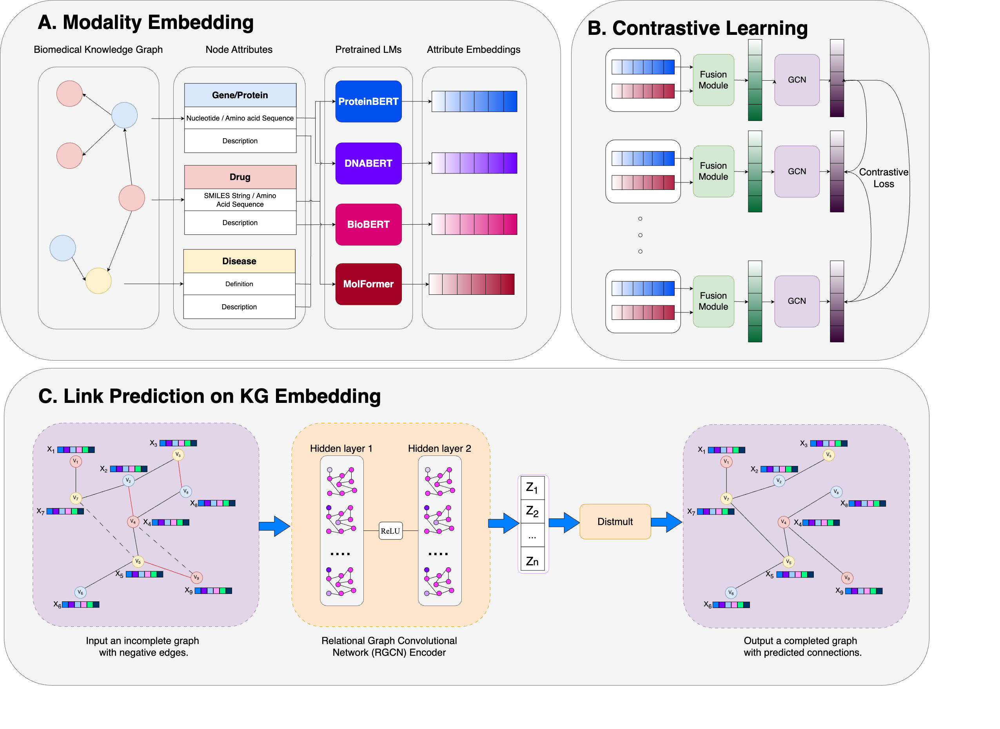

# Biomedical Knowledge Graph



## Setup

### Prepare data

Create a `data/` folder, then download the enhanced modality CSV files from Google Drive, and save them in `data/modalities/`

### Installation

Run the following command to build the module and install dependencies.

```
conda create --name biokg python=3.9
conda activate biokg
make
```

## Train

`export COMET_API_KEY=<your-comet-api-key>` to track the training process on Comet dashboard

### Graph Contrastive Learning

To train a graph on contrastive learning with intra-node type, for example, with `gene`, try:

```
bash scripts/gcl.sh
```

### Link Prediction

To train the Knowledge Graph on Link Prediction task:

```
bash scripts/kge.sh
```

## Run DPI benchmark

To fine-tune the KGE model on DPI benchmark:

```
bash scripts/dpi.sh
```
